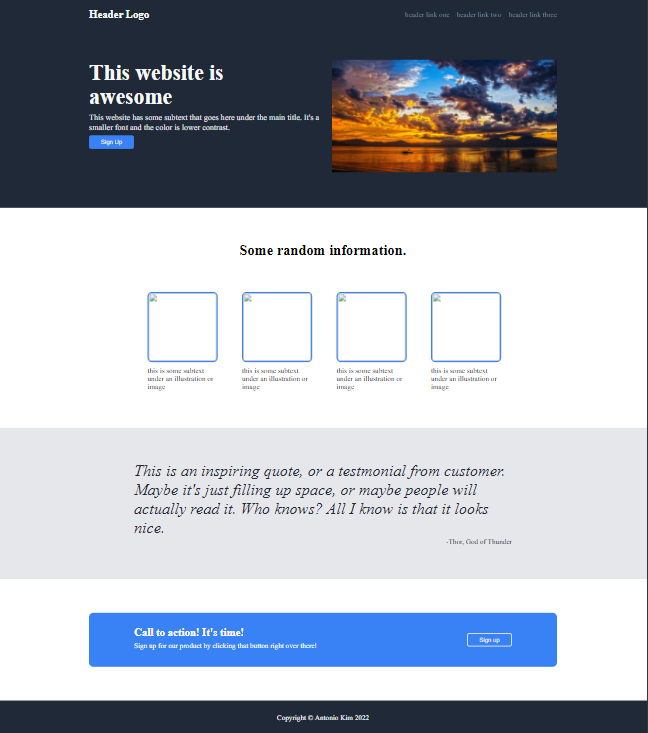

# Landing Page Project

This project consists of html and css and tries to replicate
the website like this one: https://cdn.statically.io/gh/TheOdinProject/curriculum/main/foundations/html_css/project/odin-project.png

The project is considered finished, but definitely needs some work. Some of the things that needs improvements are:

- Website to be more responsive
- Need to center the text in the information section
- Font is not exactly the same as stated, but the font style could not be found in Google fonts

Source and the instruction of the project is found at https://www.theodinproject.com/paths/foundations/courses/foundations/lessons/landing-page. The image is from pixaby.com
